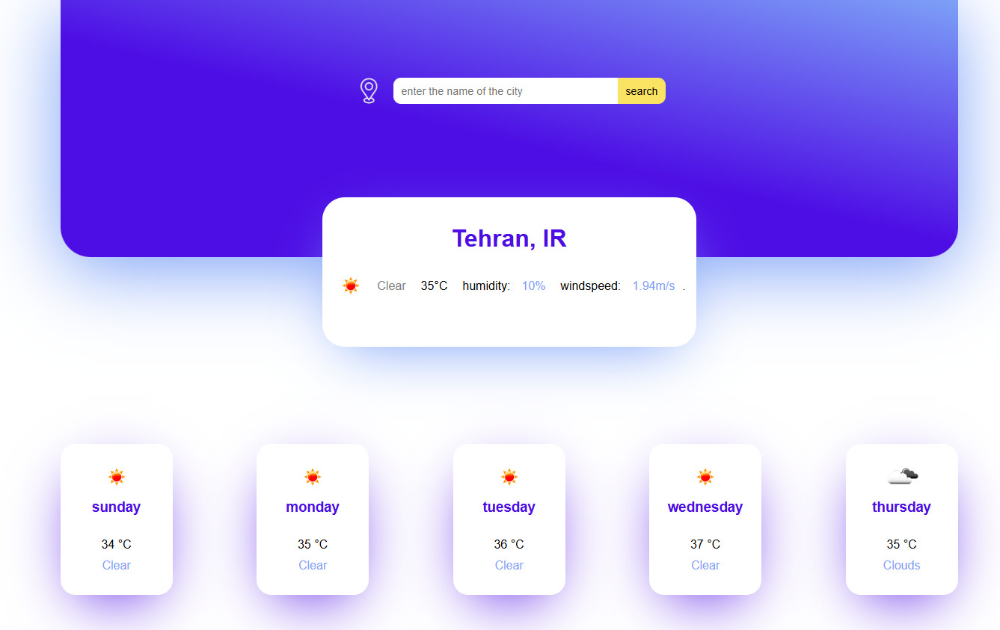

# 🚀weather site

این سایت برای پیش بینی هوای تمامی شهرهای جهان ساخته شده است. همچنین مینواند هوای  روز اینده رو پیش بینی کند.
در این پروژه کار با دیتاهای بزرگ مانند هواشناسی تمرین شده است.

 

---

## ✨ ویژگی‌ها
- پیش بینی هوای تمامی شهرهای حهان
- پیش بینی هوا روز آینده
-گرفتن جدیدترین دیتا از بزرگ ترین سایت دیتاهای هواشناسی
-  

---

## 🛠️ تکنولوژی‌ها
- HTML5  
- CSS3 (Flexbox, Grid, Responsive Design)  
- JavaScript (ES6+, DOM, LocalStorage)  

---

## 🎯 دموی آنلاین
👉 [مشاهده پروژه در GitHub Pages](https://github.com/zahramalekpour/weathersite)

---

## 📸 اسکرین‌شات

(./images/Capture2.PNG)
(./images/Capture3.PNG)

